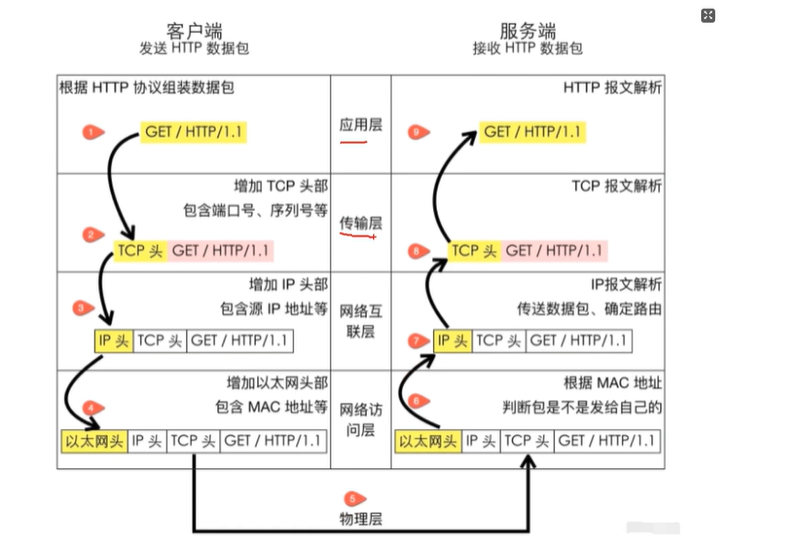

# TCP/IP 协议20问

## 1/什么是TCP网络分层

一共分为5层：应用层 》》 传输层 》》 网络互连层 》》 网络访问层 》》 物理层
比如说从客户端发送报文，那么必定会经过五层

* （0）由客户端Client发送HTTP请求
* （1）在应用层：从client发送请求，第一层根据HTTP协议组装数据包，以GET方式，携带了GET/HTTP/1.1头进行请求，
* 2）在传输层，增加TCP头部，包含端口号序列号等 TCP头/GET/HTTP/1.1
* 3）在网络互连层，增加IP头部，包含源IP地址等，IP头/TCP头/GET/HTTP/1.1
* 4）在网络访问层，增加以太网头部，包含MAC地址等，以太网头/IP头/TCP头/GET/HTTP/1.1
* 5）来到物理层，到服务端
* 6）继续走到网络访问层，以太网头/IP头/TCP头/GET/HTTP/1.1，根据MAC地址，判断包是不是发给此服务端的，继续走
* 7）来到网络互联层，由IP报文解析，传送数据包，确定路由，IP头/TCP头/GET/HTTP/1.1
* 8）走到下一层，传输层，根据TCP报文解析，/TCP头/GET/HTTP/1.1
* 9）走到应用层，进行HTTP报文解析，保留GET/HTTP/1.1
* 10）来到服务端，接受HTTP数据包
* 
**这种网络分层架构的好处：**

* 应用层：应用程序之间如何互相传递报文，比如HTTP协议
* 传输层：传输层的作用为两台主机之间的“应用进程”提供端到端的逻辑通信，比如TCP协议
* 网络互联层：网络互连层提供了主机到主机的通信，将传输层产生的数据包封装成分组数据包发送到目标主机，并提供路由选择的能力；IP协议是网络层的主要协议，TCP和UDP都是用IP协议作为网络层协议；这一层的主要作用是给包加上源地址和目标地址，将数据包传送到目标地址
* 网络访问层：网络访问层也可以叫做网络接口层，以太网、wifi、蓝牙工作在这一层，网络访问层提供了主机连接到物理网络需要的硬件和相关的协议
* 好处：
  * 各层独立：限制了依赖关系的范围，各层之间使用标准化的接口，各层不需要知道上下层是如何工作的，增加或修改一个应用层协议不会影响传输层的协议
  * 灵活性更好：比如路由器不需要应用层和传输层，分层以后路由器就可以只用加载更少的几个协议层，
  * 易于测试和维护：提高了可测试性，可以独立的测试特定层，某一层有了更好的实现可以整体替换掉
  * 能促进标准化：每一层职责清楚，方便进行标准化

---

## 2/TCP的三次握手中为什么是三次？为什么不是两次、四次？
1、三次握手讲解：
* 第一次：client向服务器发送一个SYN（同步）包，表面客户端需要与服务器建立连接，并在包中指定了自己的初始序列号Seq=x；此刻客户端进入SYN_SENT状态
* 第二次：服务端接收到客户端的SYN包后，会向客户端发送一个SYN+ACK包，其中ACK是对客户端SYN的确认，确定号为Ack=x+1；同时服务器也会指定自己的初始序列号为Seq=y；此刻服务器进入SYN_RCVD状态
* 第三次：客户端接收到服务端的SYN+ACK包后，会向服务器发送一个ACK包，确认包号为ACK=y+1；序列号为Seq=x+1；服务器收到这个ACK包后，连接建立成功，双方进入ESTABLISHED状态；
  
2、为什么不是两次
* 无法确认客户端接收能力：两次握手，服务器无法确认客户端是否接收到正确的SYN+ACK包；比如客户端的SYN包丢失，服务器发送的SYN+ACK包到了客户端，客户端会认为这是一个新的请求而发送RST包拒绝，而服务器认为连接已经建立，导致后续传输出现问题
* 无法可靠建立连接：两次握手不能确认双方都确认彼此的接收和发送能力，可能出现数据传输不稳定的情况，无法保证TCP连接的可靠性

3、为什么不是四次
* 三次已经完成确认：多此一举
* 效率问题：网络开销和时间延迟

**问法**
* 1、原理角度
  * 详细解释一下 TCP 三次握手的过程，以及每一次握手的作用是什么？
    * 第一次握手：client发送SYN包，告知server自己需要建立连接和初始序号，
    * 第二次握手：server发送SYN+ACK包，确认client请求和告知自己的序列号
    * 第三次握手：client发送ACK包，让server知道了client已经收到server的请求，双方确认可以正常收发数据
  * 在 TCP 三次握手过程中，各个阶段的数据包都包含哪些主要字段，这些字段是如何变化的？
    * SYN/ACK/Seq/Ack等字段
    * 第一次：SYN=1,Seq=x，
    * 第二次：SYN=1,ACK=1,Ack=x+1，Seq=y
    * 第三次：ACK=1,Ack=y+1，Seq=y+1
  * TCP 三次握手的过程中，如果第二次握手丢失了，会发生什么情况？
    * client会无法接收到服务器确认而重发SYN包，服务端未接收到client的SYN也会重发SYN+ACK，直到连接建立或超时放弃

* 2、与其它协议对比
  * TCP 三次握手和 UDP 的连接方式有什么本质区别？为什么 UDP 不需要类似的握手过程？
    * TCP是面向连接、可靠的传输协议，需要三次握手进行确认连接保证数据的可靠传输，UDP是无连接的，不保证数据可靠到达，无需握手，适用于对实时性要求高但不要求绝对可靠的场景，如视频直播
  * HTTP 基于 TCP 协议，它在建立连接时是如何利用 TCP 三次握手的
    * HTTP 请求前先通过 TCP 三次握手建立连接，握手成功后 HTTP 在连接上进行数据请求和传输。
* 3、实际应用和优化角度
  * 在高并发场景下，TCP 三次握手可能会带来哪些性能问题？如何优化？
    * 连接延迟、资源消耗；可采用：连接池、优化TCP参数增加缓存，调整超时时间
  * 请举例说明在实际的网络应用中，TCP 三次握手是如何保证数据传输的可靠性的？
    * 三次握手确认client和server准保好传输数据，后续传输、重传等机制保证数据准确到达
  * 在网络环境不稳定的情况下，TCP 三次握手可能会遇到哪些挑战？如何应对这些挑战？
    * 丢包、延迟、资源占用；超时重传、快速重传、拥塞机制

* 4、拓展角度
  * 除了三次握手，TCP 还有哪些重要的机制来保证网络通信的可靠性和效率？
    * 确认应答、超时重传、滑动窗口、拥塞机制
  * 如果让你设计一个类似 TCP 的传输协议，你会考虑保留三次握手这个机制吗？为什么
    * 会；简单高效确认双方确认连接状态和收发能力，为后续可靠连接传输奠定基础，保证连接准确性和高效性的经典设计

## 3/TCP的四次挥手为什么是四次？为什么不能是三次？

## 4/为什么 SYNFIN 不包含数据却要消耗一个序列号
## 5/什么是半连接队列？什么是SYN Flood攻击？
## 6/说说TCP快速打开(TFO)的原理！
## 7/TCP报文中的时间戳有什么作用？
## 8/TCP 的超时重传时间是如何计算的？
## 9/能不能说一说 TCP 的流量控制？
## 10/如何理解 TCP 的keep-alive的原理？
## 11/聊一聊TCP中的端口号
## 12/TCP场景问题1
## 13/TCP场景问题2
## 14/TCP场景问题3
## 15/讲一讲telnet的用法
## 16/讲一讲netstat的用法
## 17/讲一讲tcpdump的用法
## 18/讲一讲wireshark的用法
## 19/TCP和UDP的区别
## 20/如果要你来设计一个QQ，在网络协议上你会考虑什么
1、登录采用TCP、HTTP，实时聊天UDP，内网P2P
2、登录过程，客户端client采用TCP协议向服务器server发送信息，HTTP协议下载信息，登录之后，会有一个TCP连接来保持在线状态
3、同好友进行信息传输，客户端client采用UDP将进行双向传输，但是还是得经过nginx服务器反向代理转发，为了确保传输消息的可靠，得采用上层协议保证可靠传输，如果消息发送失败，客户端会提示传输失败，进行重新传输
4、内网传输：P2P，无需服务器中转

